# Kit de taller

- [Arduino Nano 5V 16MHz](https://es.aliexpress.com/item/32607801066.html?spm=a2g0s.9042311.0.0.274263c0poFovm)
- [Cable USB Mini](https://es.aliexpress.com/item/32607801066.html?spm=a2g0s.9042311.0.0.274263c0poFovm)
- [Breadboard 400 pin](https://es.aliexpress.com/item/32658515031.html?spm=a2g0s.9042311.0.0.274263c0NZAqoH)
- [Jumper Cables](https://es.aliexpress.com/item/33038355606.html?spm=a2g0s.9042311.0.0.274263c0XEySyf)
- [Servomotor SG90](https://es.aliexpress.com/item/32841541380.html?spm=a2g0s.9042311.0.0.274263c0r37u9V)
- [Piezo Buzzer](https://es.aliexpress.com/item/32914327679.html?spm=a2g0s.9042311.0.0.274263c0aAODxc)
- [LEDs](https://es.aliexpress.com/item/32886530132.html?spm=a2g0s.9042311.0.0.274263c0NZAqoH)
- [Potentiometer](https://es.aliexpress.com/item/32680095061.html?spm=a2g0s.9042311.0.0.274263c0r37u9V)
- [Switches](https://es.aliexpress.com/item/32877207984.html?spm=a2g0s.9042311.0.0.274263c0r37u9V)
- [330 Ohm Resistor](https://es.aliexpress.com/item/32526023399.html?spm=a2g0s.9042311.0.0.274263c0NZAqoH)
- [10K Ohm Resistor](https://es.aliexpress.com/item/32526023399.html?spm=a2g0s.9042311.0.0.274263c0NZAqoH)
- [Photoresistor](https://es.aliexpress.com/item/32623615207.html?spm=a2g0s.9042311.0.0.274263c0NZAqoH)
- [TMP36](https://es.aliexpress.com/item/33000245948.html?spm=a2g0s.9042311.0.0.274263c0NZAqoH)

# Como Empezar

## Instalar Software

1. Windows/OSX: Instalar [drivers de USB CH340G](drivers/) (Linux vienen por defecto)
2. Instalar [Arduino IDE](https://www.arduino.cc/en/main/software)

## Conectar el Arduino

1. Conectar el Arduino por USB
2. Ir a Herramientas y selecionar `Arduino Nano`, `ATMEGA328P`, y el puerto que corresponda.

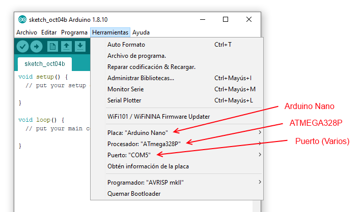

## Para subir un codigo basico al Arduino

1. Ir a Fichero > Ejemplos > Basics > Blink
2. 'Subir' codigo al Arduino

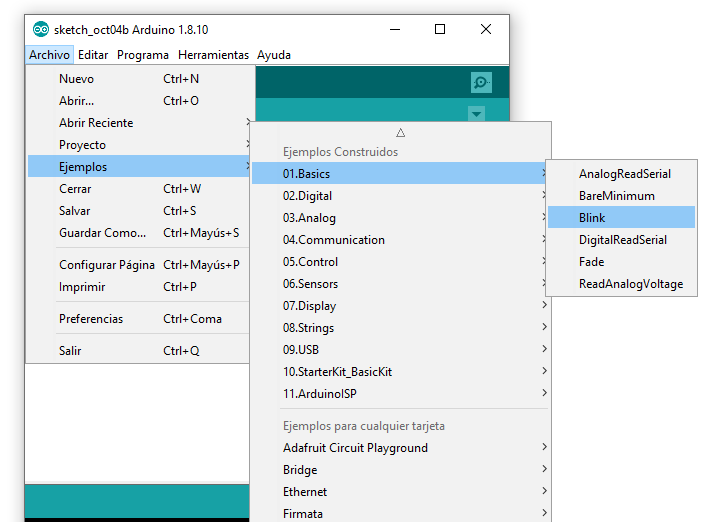
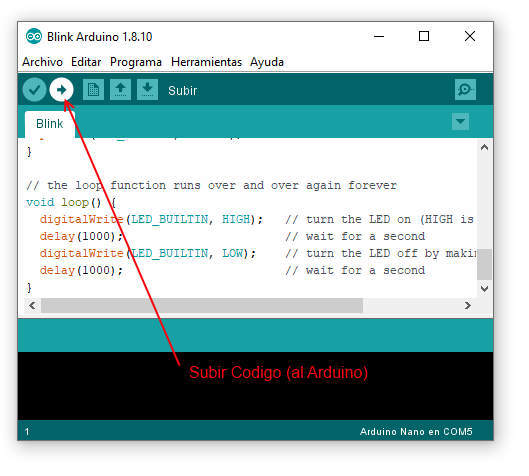

# Herramientas: Arduino Nano

El nano **tiene un LED ya conectado** con el pin 13 con la letra 'L', se puede cambiar la velocidad con el programa de 'blink'

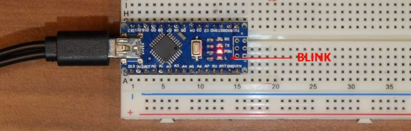

# Herramientas: Placa

Se usa para conectar componentes. Se puedan crear **varias conexiones en cada uno de los pines**.

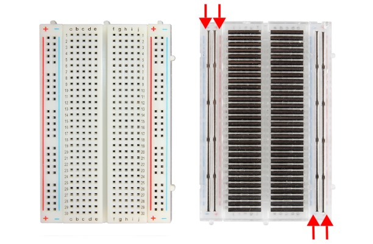

# Primer Circuito: Blink

1. Conectar LED al pin D13: *PATA LARGA* es *POSITIVO* y va hacia el ARDUINO
2. La *PATA CORTA* del LED se conecta con el *NEGATIVO* y as su vez, con el pin GND (Groud = Tierra = Negativo).
3. Se puede usar una resistencia de 330 Ohm en el LED D13 pero es opcional, ya que el Arduino ya lleva una internamente.

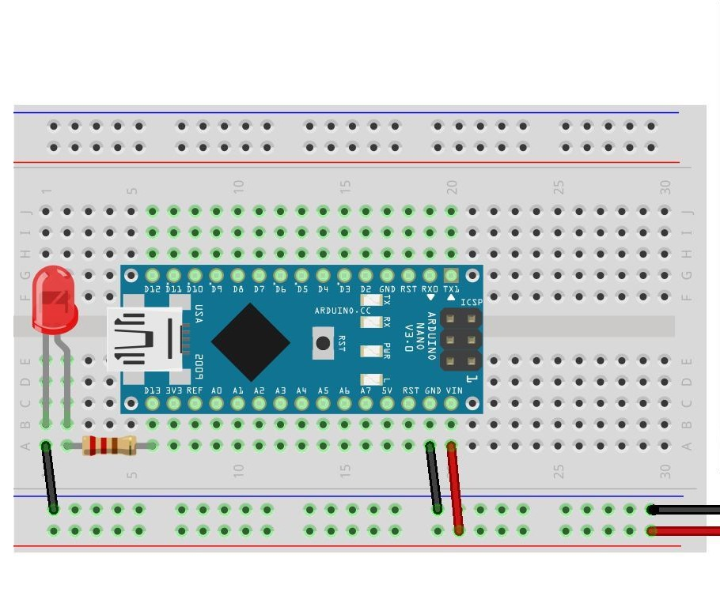

# Segundo Circuito: Fotoresistencia

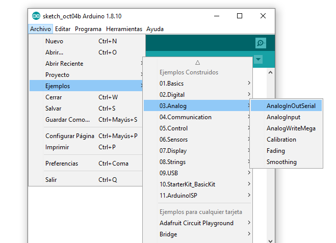

1. Conectar Fotoresistencia a cualquier pin A0-A7.
2. Usar `int valor = analogRead(A0);` para leer el valor de la fotoresistencia, que sera entre 0 y 1023.
3. Abrir `Herramientas > Monitor de Serie` para ver los valores que manda la fotoresistencia al PC por USB

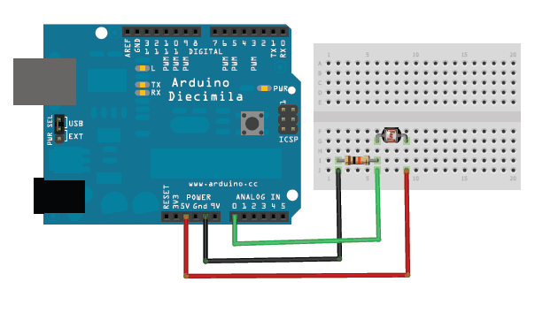

# Tercer Circuito: Zumbador (Buzzer)

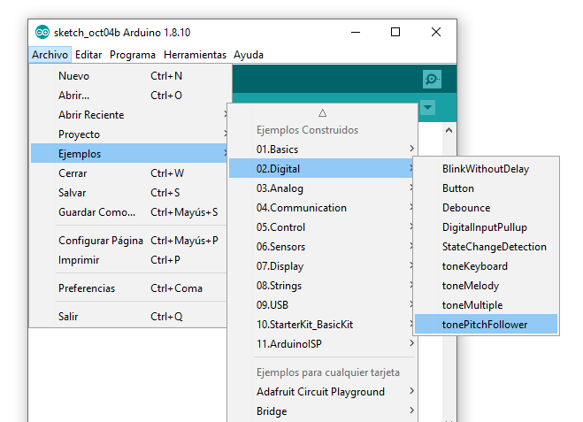

1. Conectar el Zumbador a un pin con PWM (Ver [#pinout](#Pinout))
2. Usar `tone(PIN, FREQUENCY, DURATION)` para generar un tono basado en la fotoresistencia.

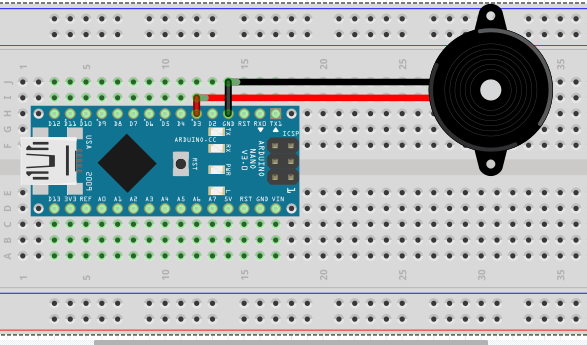

# Cuarto Circuito: Servomotor

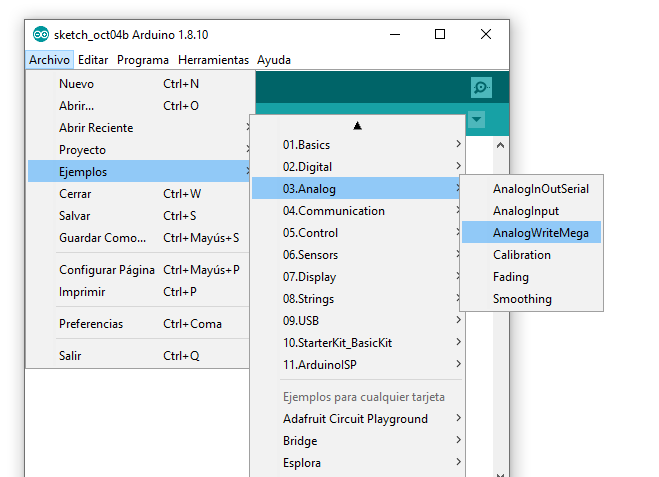

El servomotor tiene 3 cables:

1. Electricidad *POLO POSITIVO* (rojo)
2. Electricidad *POLO NEGATIVO* (marron o negro)
3. Señal (en amarillo)

1. Conectar el Servomotor pins 5V (rojo), GND (marron) y un pin con PWM como el D9 (amarillo)
2. Usar `analogWrite(pin, val)` para controlar el servomotor, `val` puede tener valor entre 0 y 255.

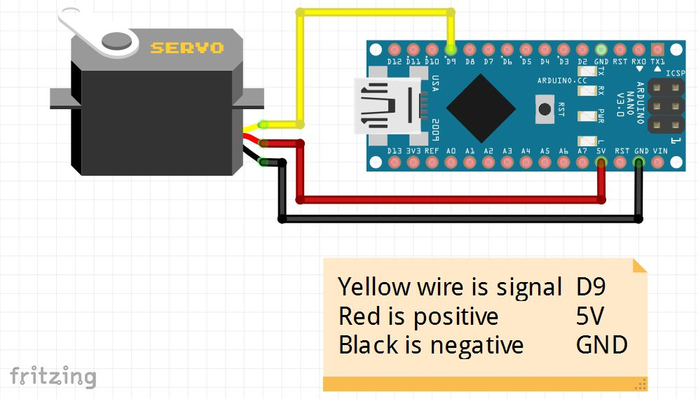

## Pinout

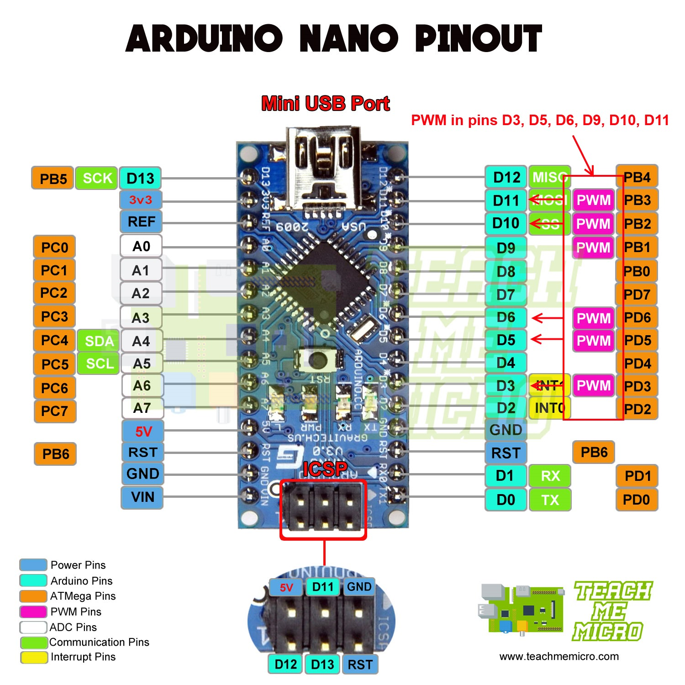
