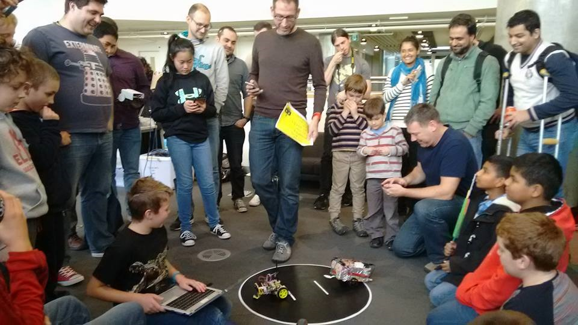

# Kit Robot Luchador (Sumobot)

- [Arduino Nano 5V 16MHz](https://es.aliexpress.com/item/32881632966.html?spm=a2g0o.productlist.0.0.3bb06c80zwYrpU)
- [Cable USB Mini 1.8m](https://es.aliexpress.com/item/32766726085.html?spm=a2g0s.9042311.0.0.274263c0UhnbFW)
- [4 Mini Breadboard 170pin](https://es.aliexpress.com/item/32914730439.html?spm=a2g0s.9042311.0.0.274263c0r37u9V)
- [Jumper Cables](https://es.aliexpress.com/item/33038355606.html?spm=a2g0s.9042311.0.0.274263c0XEySyf)
- [5V Motors + Wheels](https://es.aliexpress.com/item/32898809340.html?spm=a2g0s.9042311.0.0.274263c0YemnNP)
- [Motor H-Bridge L9110S](https://es.aliexpress.com/item/32832842902.html?spm=a2g0o.detail.1000014.38.70684aaaNMwt5C)
- [Battery Case AAA](https://es.aliexpress.com/item/32828011267.html?spm=a2g0s.9042311.0.0.274263c0lWT13q)
- [4x NIMH Batteries](https://www.ikea.com/es/es/p/ladda-pila-recargable-90303880/)
- [Ultrasonic Sensor HC-SR04](https://es.aliexpress.com/item/585734969.html?spm=a2g0s.9042311.0.0.274263c0YemnNP)
- [Zip Ties](https://es.aliexpress.com/item/4000061028039.html?spm=a2g0o.productlist.0.0.49b5480c4vuaZO)

# Reglas de Competicion

2 robots se suben al ring! Solo uno saldra victorioso!

- Los robots tienen que caber en un cubo de 25cm de lado
- El ring es de 1m de diametro aprox, con fondo negro y lineas en blanco.
- Cada combate son 3 rondas de 60 segundos entre 2 robots.
- Equipos participan aleatoriamente, quedandose 2 robots victoriosos para la final.
- Es posible destruir/danar al robot oponente, pero no es aconsejable. Perdiendose merito ante otros competidores y causando posible descalificacion.

## Puntuacion

- Si un robot sale (o pisa) fuera del ring, pierde ante su oponente.
- El robot que gane 2 rondas es el ganador.
- Si ningun robot gana una ronda, el arbitro decide a su propio criterio. Incluyendose cosas como cual de los robots le parece mas chulo.
